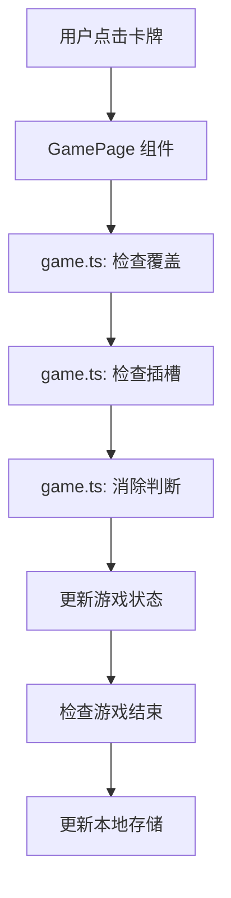

# 架构文档

## 项目架构

### 目录结构

```
sheep/
├── src/                    # 源代码目录
│   ├── pages/              # 页面
│   │   ├── game/           # 游戏主页面
│   │   ├── level/          # 关卡选择页面
│   │   └── mine/           # 我的页面
│   ├── components/         # 组件
│   │   ├── GameCard/       # 游戏卡片组件
│   │   ├── GameBoard/      # 游戏面板组件
│   │   └── CardSlot/       # 卡片槽组件
│   ├── data/               # 数据
│   │   └── levels.ts       # 关卡配置
│   ├── utils/              # 工具函数
│   │   ├── game.ts         # 游戏核心逻辑
│   │   ├── storage.ts      # 本地存储
│   │   ├── sound.ts        # 音效管理
│   │   └── dailyTasks.ts   # 每日任务
│   ├── styles/             # 全局样式
│   ├── types/              # TypeScript 类型定义
│   ├── app.ts              # 应用入口
│   └── app.config.ts       # 应用配置
├── config/                 # Taro 配置
├── dist/                   # 构建输出
└── package.json            # 项目配置
```

### 核心模块

| 模块 | 职责 | 文件位置 | 说明 |
|------|------|----------|------|
| 游戏核心 | 卡牌生成、布局、点击判断 | `src/utils/game.ts` | 游戏的核心逻辑 |
| 状态管理 | 游戏状态、计时器、分数 | `src/pages/game/index.tsx` | 使用 React Hooks 管理状态 |
| 本地存储 | 游戏记录、最佳时间 | `src/utils/storage.ts` | 基于 Taro 存储 API |
| 关卡配置 | 关卡难度、卡牌数量 | `src/data/levels.ts` | 定义各关卡参数 |
| 组件系统 | UI 组件 | `src/components/` | 可复用组件 |

### 数据流



## 技术栈

| 技术 | 版本 | 用途 |
|------|------|------|
| Taro | 4.1.9 | 跨端框架 |
| TypeScript | 5.x | 类型安全 |
| React | 18.x | UI 框架 |
| SCSS | - | 样式预处理器 |
| Jest | - | 单元测试 |
| ESLint | - | 代码质量检查 |
| Prettier | - | 代码格式化 |

## 核心功能

### 1. 卡牌生成算法

**文件**：`src/utils/game.ts`

- 根据关卡配置生成卡牌池
- 确保每种卡牌数量为 3 的倍数
- 随机洗牌保证游戏的可玩性
- 分层布局（上层覆盖下层）

### 2. 遮挡检测

**文件**：`src/utils/game.ts` - `checkCover` 函数

- 检查每张卡牌是否被其他卡牌覆盖
- 确保只有最上层未被覆盖的卡牌可点击
- 优化点击判断逻辑

### 3. 游戏状态管理

**文件**：`src/pages/game/index.tsx`

- 使用 `useState` 管理游戏状态
- 使用 `useRef` 解决闭包陷阱（如计时器）
- 使用 `useEffect` 处理副作用

### 4. 计时器实现

**文件**：`src/pages/game/index.tsx`

- 使用 `setInterval` 实现计时
- 解决闭包陷阱问题
- 确保暂停/失败时正确停止

### 5. 分享回调

**文件**：`src/pages/game/index.tsx` - `onShareAppMessage`

- 利用微信分享机制
- 全局 `ref` 实现跨函数状态更新
- 自动重新开始逻辑

## 构建与部署

### 构建流程

1. 本地开发：`npm run dev:weapp`
2. 生产构建：`npm run build:weapp`
3. 微信开发者工具上传
4. 微信公众平台发布

### CI/CD

- GitHub Actions 自动运行类型检查、代码风格检查和构建
- 依赖自动更新（每周）
- 安全扫描（每周）

## 扩展与维护

### 添加新关卡

修改 `src/data/levels.ts`：

```typescript
const levelConfig = [
  // ... 现有关卡
  {
    types: 10,        // 卡牌种类数
    cardsPerType: 12, // 每种卡牌数量（必须是 3 的倍数）
    layers: 6,        // 层数
    layerOffset: 30   // 层偏移（像素）
  }
];
```

### 添加新卡牌

修改 `DOG_EMOJIS` 数组：

```typescript
export const DOG_EMOJIS = [
  '🐕', '🐶', '🐩', '🦮', '🐕‍🦺',
  // ... 添加更多表情
];
```

### 性能优化

1. 使用 `React.memo` 优化组件渲染
2. 避免不必要的状态更新
3. 使用 `useCallback` 和 `useMemo` 缓存函数和计算结果

## 测试策略

### 单元测试

- 测试核心工具函数
- 测试组件渲染
- 测试游戏逻辑

### 集成测试

- 测试页面间跳转
- 测试完整游戏流程
- 测试分享功能

### E2E 测试

- 使用微信开发者工具进行真机测试
- 测试各种边界情况

## 安全考虑

1. 不要在代码中硬编码敏感信息
2. 验证用户输入
3. 定期更新依赖项
4. 进行安全扫描

## 未来规划

1. 添加更多关卡
2. 实现 H5 版本
3. 添加排行榜功能
4. 优化性能
5. 增强用户体验
